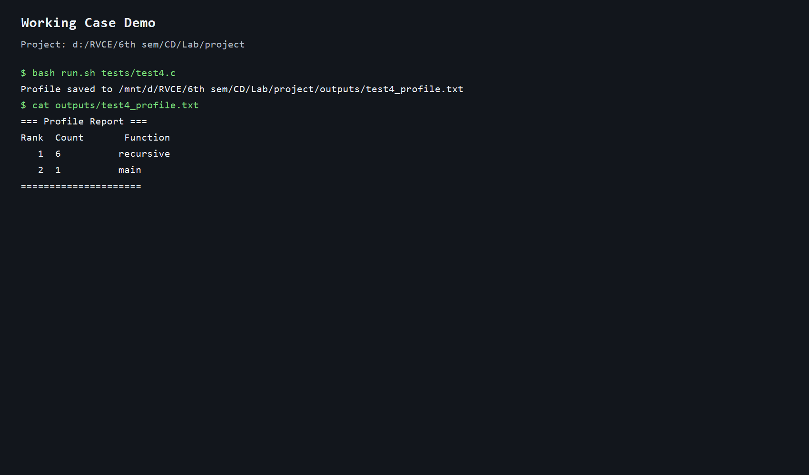
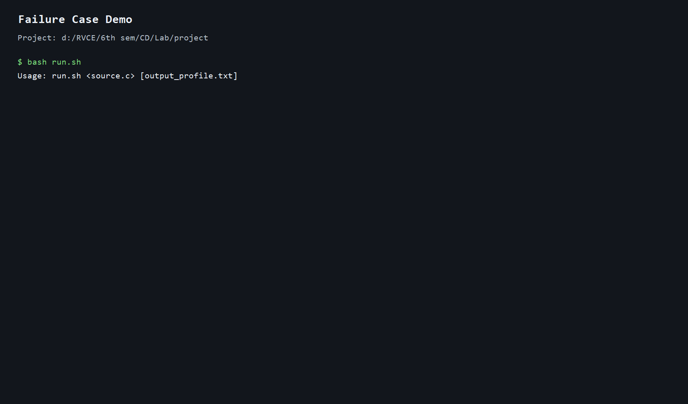

# DEMO

This document describes the demo procedure and provides captured outputs for both working and failure cases.

## Environment

- Ubuntu 22.04 on WSL2
- LLVM 18.1.3, Clang 18, CMake 3.28 (installed via apt)

---

## Working Case

### Step 1 — Build

```bash
bash build.sh
```

Expected output:
```
-- Found LLVM 18.1.3 at /usr/lib/llvm-18/lib/cmake/llvm
[100%] Built target FunctionProfiler
Build complete: pass plugin and runtime object are in <project-dir>/build
```

### Step 2 — Profile a recursive program

```bash
bash run.sh tests/test4.c
cat outputs/test4_profile.txt
```

Expected output:
```
=== Profile Report ===
Rank  Count       Function
   1  6          recursive
   2  1          main
=====================
```

`recursive` is called 6 times (1 initial call + 5 recursive steps) — exactly correct.

### Step 3 — Profile a sorting benchmark

```bash
bash run.sh benchmarks/sort_bench.c outputs/sort_bench_profile.txt
cat outputs/sort_bench_profile.txt
```

Expected output:
```
=== Profile Report ===
Rank  Count       Function
   1  26773896   partition
   2  23951420   merge
   3  1999999    mergesort
   4  1333663    quicksort
   5  1000002    main
   6  1000002    fill_random
=====================
```

### Screenshot



---

## Failure Case

### Failure — Runtime Not Linked

Instrument the binary but deliberately skip linking `runtime.o`:

```bash
clang -O0 -S -emit-llvm tests/test4.c -o /tmp/test4.ll
opt -load-pass-plugin build/FunctionProfiler.so \
    -passes="profiler-pass" /tmp/test4.ll -o /tmp/test4_inst.bc
clang /tmp/test4_inst.bc -o /tmp/test4_fail
```

Expected error:
```
/usr/bin/ld: error: undefined symbol: __profiler_register
/usr/bin/ld: error: undefined symbol: dumpProfile
```

The binary cannot link because the runtime is missing. Fix: add `build/runtime.o` to the link command.

### Screenshot


